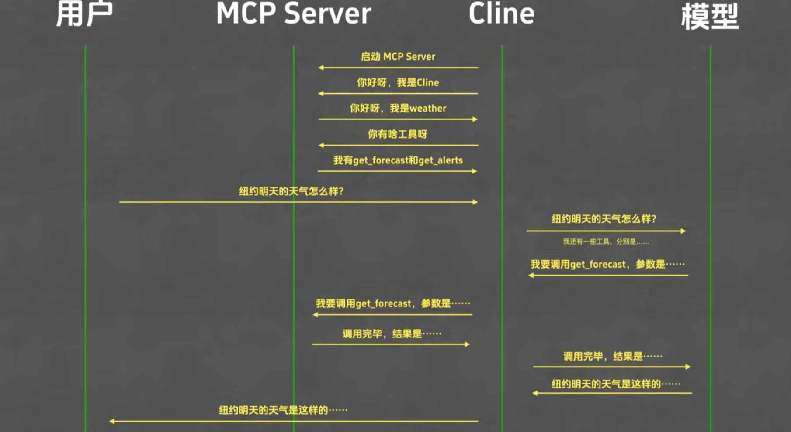
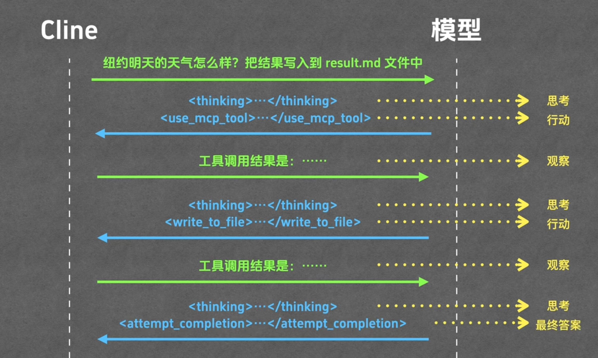

# ClaudeCodeExample

The repo is for me to familiarize Claude Code &amp; Agent.

It contains some things I found may be useful to my Claude Code.

**Skills**

- skill-creator

**Agents**

**MCP**

**Plugins**

**Rules**

## Claude Code Workflow

## Tips and Notes

### Claude Code

- 干就完了模式

```json
claude --dangerously-skip-permissions
```

- ctrl + G 在vscode 里编辑
- 双击esc回滚
  - /resume 回到之前对话
  - 启动时使用claude -c
- /tasks后台再跑的任务
- 上下文压缩
  - /compact + 自定义要求
  - 最好在还剩20%左右手动执行一下
- Hooks - 在执行不同的阶段运行不同内容
- Skills - 共享主对话上下文 - 如果过于庞大会消耗很多token
  - 处理与上下文关联大，但是对上下文影响不大
- Sub-Agent - 与Skills类似，但是上下文完全独立 - 新开一个窗口 - 只会返回最终结果
  - 处理与上下文关联小，但是对上下文影响大
- Agent Teams：
  - [协调 Claude Code 会话团队 - Claude Code Docs](https://code.claude.com/docs/zh-CN/agent-teams)

### Skill

带说明书的Prompt，定义了 Agent 在遇到特定任务时应遵循的步骤、风格或调用的本地脚本。

MCP让模型获得数据，Skil用于解释How to Deal with数据

- Skill Example:

```json
your-skill-name/
├── SKILL.md                  # 必须——主 Skill 文件
├── scripts/                  # 可选——可执行代码
│    ├── process_data.py      # 示例
│    └── validate.sh          # 示例
├── references/               # 可选——文档
│    ├── api-guide.md         # 示例
│    └── examples/            # 示例
└── assets/                   # 可选——模板等
     └── report-template.md  # 示例
```

### MCP

可以用于接入和获取外部的数据 + 权限管理支持

MCP Wrokflow Example:




### Plugins

类似全家桶安装包 打包skill hook subagent mcp commands tools等

Example：
https://github.com/anthropics/financial-services-plugins.git
